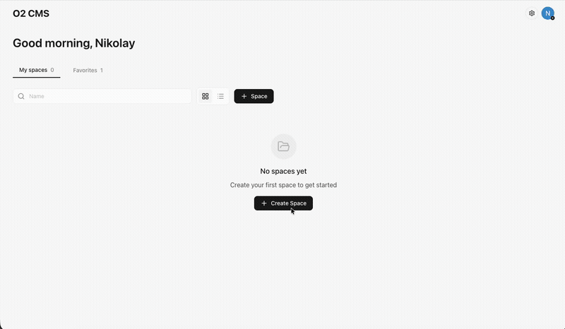

# O2 CMS

A modern, multi-tenant headless content management system built with Next.js and Firebase. O2 CMS provides a Contentful-compatible API, making it easy to migrate from Contentful or integrate with existing Contentful-based frontends.

## Live Demo

Try O2 CMS now at **[https://o2cms.com](https://o2cms.com)**



## Features

- **Multi-tenant architecture** -- isolated spaces with role-based access control (Owner, Admin, Editor, Viewer)
- **Content modeling** -- define custom content types with a rich set of field types (text, rich text, media, references, JSON, and more)
- **Rich text editor** -- built-in TipTap-based editor with tables, links, and media embeds
- **Asset management** -- upload, organize, and serve images and files via Firebase Storage
- **Environments** -- manage content across multiple environments (e.g., master, staging)
- **Contentful-compatible REST API** -- Content Delivery API (CDA) and Content Management API (CMA) following Contentful conventions
- **GraphQL API** -- query content with a fully generated GraphQL schema
- **Full-text search** -- optional Typesense integration for fast content search
- **Webhooks** -- trigger external services on content changes
- **API keys** -- scoped API keys for programmatic access
- **Invitation system** -- invite team members via email with SendGrid integration
- **Contentful migration tool** -- built-in wizard to import content types, assets, and entries from Contentful
- **MCP server** -- Model Context Protocol support for AI-powered integrations

## Tech Stack

| Layer | Technology |
|-------|-----------|
| Frontend | [Next.js](https://nextjs.org/) 16, [React](https://react.dev/) 19, [TypeScript](https://www.typescriptlang.org/), [Tailwind CSS](https://tailwindcss.com/) |
| Backend | [Firebase Cloud Functions](https://firebase.google.com/docs/functions) (v2), [Express](https://expressjs.com/), [Apollo Server](https://www.apollographql.com/docs/apollo-server/) (GraphQL) |
| Database | [Cloud Firestore](https://firebase.google.com/docs/firestore) |
| Auth | [Firebase Authentication](https://firebase.google.com/docs/auth) |
| Storage | [Firebase Storage](https://firebase.google.com/docs/storage) |
| Search | [Typesense](https://typesense.org/) (optional) |
| Email | [SendGrid](https://sendgrid.com/) (optional) |

## Prerequisites

- [Node.js](https://nodejs.org/) v20 or later
- [Firebase CLI](https://firebase.google.com/docs/cli) (`npm install -g firebase-tools`)
- A Firebase project with Firestore, Authentication, and Storage enabled
- [Google Cloud CLI](https://cloud.google.com/sdk/docs/install) (for deployment)

## Quick Start

### 1. Clone and install dependencies

```bash
git clone https://github.com/t4u-automation/o2cms.git
cd o2cms

# Install frontend dependencies
npm install

# Install Cloud Functions dependencies
cd functions && npm install && cd ..
```

### 2. Configure environment

```bash
cp .env.example .env.local
```

Edit `.env.local` with your Firebase project credentials. You can find these in the [Firebase Console](https://console.firebase.google.com/) under **Project Settings > General > Your apps**.

### 3. Start the development server

```bash
npm run dev
```

The app will be available at [http://localhost:3000](http://localhost:3000).

### 4. Deploy Cloud Functions

```bash
firebase login
firebase use YOUR_PROJECT_ID
firebase deploy --only functions
```

Set `NEXT_PUBLIC_API_BASE_URL` in `.env.local` to your deployed functions URL.

## Deployment

For full deployment instructions including GCP setup, secrets configuration, IAM permissions, and production deployment, see [DEPLOYMENT.md](DEPLOYMENT.md).

## Project Structure

```
o2-cms/
├── app/                    # Next.js app directory (pages, layouts, API routes)
├── components/             # React components
├── contexts/               # React contexts (Auth, Tenant)
├── hooks/                  # Custom React hooks
├── lib/                    # Shared utilities (Firebase, Firestore, API helpers)
├── types/                  # TypeScript type definitions
├── functions/              # Firebase Cloud Functions (Express API, GraphQL, triggers)
├── contentful-migration/   # Python scripts for migrating from Contentful
├── api-tests/              # API test scripts
├── public/                 # Static assets
├── firestore.rules         # Firestore security rules
├── storage.rules           # Firebase Storage security rules
└── firebase.json           # Firebase project configuration
```

## API Overview

O2 CMS exposes a Contentful-compatible REST API:

```
# Content Delivery API (read-only, public)
GET /v1/spaces/:spaceId/environments/:envId/entries
GET /v1/spaces/:spaceId/environments/:envId/assets
GET /v1/spaces/:spaceId/environments/:envId/content_types

# Content Management API (authenticated)
POST /v1/spaces/:spaceId/environments/:envId/entries
PUT  /v1/spaces/:spaceId/environments/:envId/entries/:entryId
POST /v1/spaces/:spaceId/environments/:envId/assets

# GraphQL
POST /graphql
```

See the [API tests](api-tests/) for detailed usage examples.

## Localization

O2 CMS supports multi-locale content out of the box. When a new environment is created, locales are automatically copied from the master environment (defaults to `en-US` if no master locales exist). You can add additional locales per environment via **Settings > Locales**.

## MCP Server (AI Integration)

O2 CMS includes a built-in [Model Context Protocol](https://modelcontextprotocol.io/) (MCP) server, allowing AI assistants like Cursor, Claude, and others to manage your content directly.

### Setup

1. **Deploy Cloud Functions** (if not already):

```bash
firebase deploy --only functions
```

2. **Create an API key** in O2 CMS: go to **Settings > API Keys**, click **Generate API Key**, and choose **CMA** (full access) or **CDA** (read-only).

3. **Configure your MCP client**. Add the following to your MCP settings (e.g. `.cursor/mcp.json`):

```json
{
  "mcpServers": {
    "o2-cms": {
      "url": "https://us-central1-YOUR_PROJECT_ID.cloudfunctions.net/mcp/sse?token=YOUR_API_KEY&space_id=YOUR_SPACE_ID&environment=master"
    }
  }
}
```

Replace `YOUR_PROJECT_ID`, `YOUR_API_KEY`, and `YOUR_SPACE_ID` with your values.

### Available Tools

| Category | Tools |
|----------|-------|
| Entries | `list_entries`, `get_entry`, `create_entry`, `update_entry`, `delete_entry`, `publish_entry`, `unpublish_entry`, `archive_entry` |
| Assets | `list_assets`, `get_asset`, `update_asset`, `delete_asset` |
| Content Types | `list_content_types`, `get_content_type`, `create_content_type`, `update_content_type`, `delete_content_type` |
| Environments | `list_environments`, `get_environment`, `create_environment`, `delete_environment` |
| Spaces | `list_spaces`, `get_space`, `create_space`, `update_space`, `delete_space` |
| Locales | `list_locales`, `get_locale`, `create_locale`, `update_locale`, `delete_locale` |

### Endpoints

| Method | Path | Purpose |
|--------|------|---------|
| GET | `/mcp/sse` | SSE transport (Cursor, Claude) |
| POST | `/mcp/messages` | JSON-RPC messages |
| GET | `/mcp/tools` | List available tools |
| POST | `/mcp/tools/:toolName` | Call a tool directly |

## Hosting

The frontend is deployed on [Vercel](https://vercel.com/). Cloud Functions are deployed separately via Firebase CLI. See [DEPLOYMENT.md](DEPLOYMENT.md) for details.

## Contributing

Contributions are welcome! Please read [CONTRIBUTING.md](CONTRIBUTING.md) for guidelines on how to get started.

## License

This project is licensed under the MIT License. See [LICENSE](LICENSE) for details.
